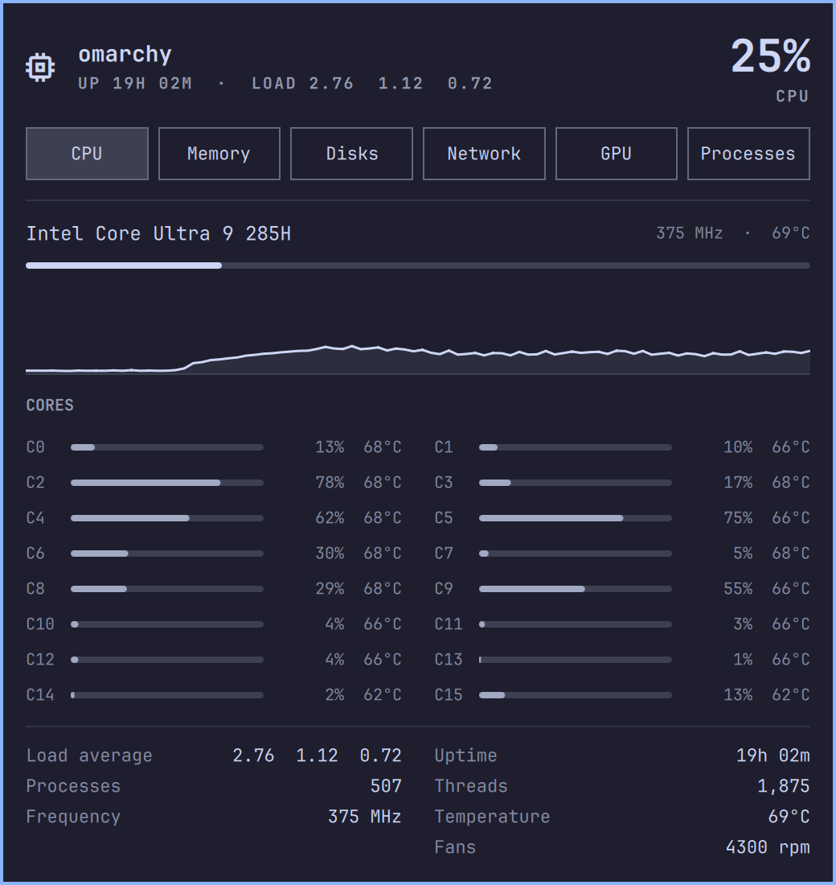
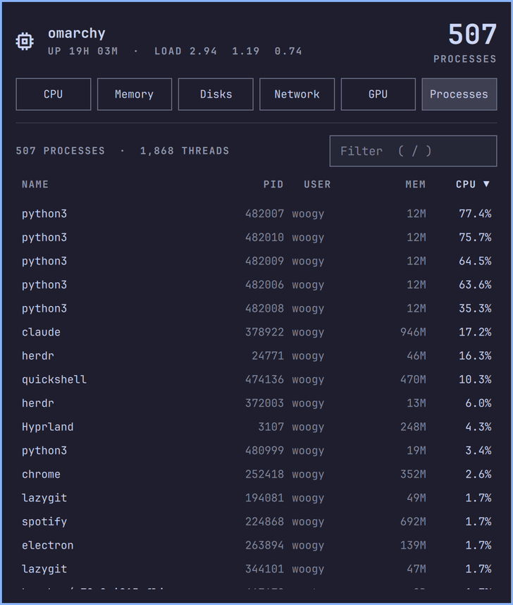
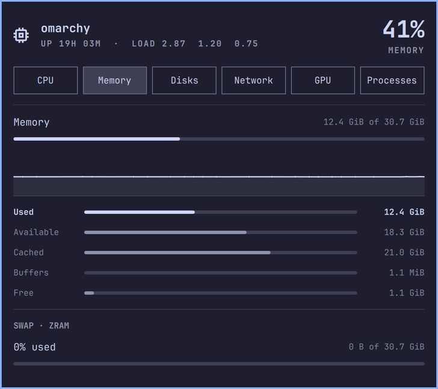
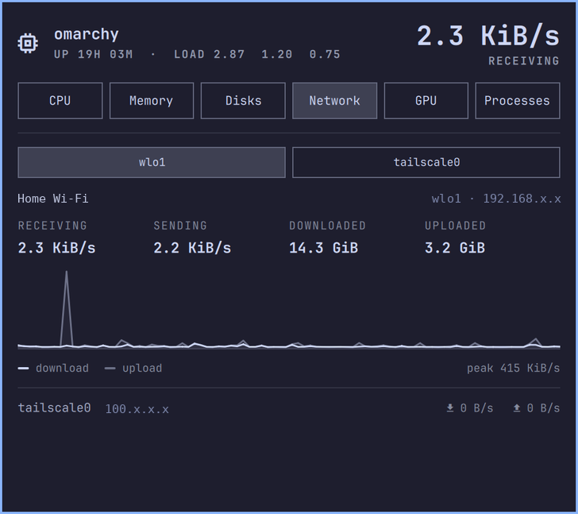

# Vitals

A calm, btop-style system monitor for the [Omarchy](https://omarchy.org) shell.
One chip icon in the bar; one panel with tabs for **CPU · Memory · Disks ·
Network · GPU · Sensors · Processes**. Same quiet look as the built-in battery and
network panels — no boxes-in-boxes, no rainbow bars.

<p align="center"></p>

<p align="center">
  
  
  
</p>

## What you get

| Tab | Shows |
|-----|-------|
| **CPU** | model, frequency, package temperature (with the peak seen so far), live usage meter and 3-minute history, one meter per core (with per-core temperature where the sensor is exposed), load average, uptime, process/thread counts, every fan by name, package power (when readable) |
| **Memory** | used / available / cached / buffers / free with proportional bars, history, swap (zram-aware) |
| **Disks** | one entry per real filesystem (btrfs subvolumes and bind mounts folded into their parent), used/free/total, read/write throughput, and the temperature of the physical drive behind each one, resolved through dm-crypt and partition layers, so an encrypted root reports its NVMe sensor |
| **Network** | interface picker, receive/send rate, totals, dual-line history, the other interfaces at a glance |
| **GPU** | Intel (i915/xe via sysfs), AMD (amdgpu sysfs) and NVIDIA (`nvidia-smi`) — busy %, clocks, temperature, power, VRAM where available; the tab hides itself if no GPU is found. Integrated graphics have no sensor of their own, so they report the CPU package they share, labelled `Temperature (die)` rather than pretending to a probe they do not have |
| **Sensors** | every usable temperature on the machine in one list (CPU package, chassis/skin, drive, Wi-Fi and platform zones), each with a bar scaled to its critical limit where one is known, the peak seen while the panel has been open, and that limit. Then every fan, by name, including the ones sitting idle. Sensors that read ~0 °C (unpopulated DPTF zones) and controller pseudo-zones are left out rather than shown as junk |
| **Processes** | sortable by name / pid / user / memory / cpu (click a column header, click again to flip), live filter, keyboard cursor; click a row (or Enter) to expand it — full command line, parent, threads, memory — with **Terminate · Kill · Pause/Resume** actions (Terminate/Kill ask first) |

Data comes from a small Python collector (`collector.py`, standard library
only, no root) that streams a JSON snapshot every second (configurable) **only while the panel is
open**. Closed panel = zero background cost; open, the whole thing (collector +
shell rendering) sits around 3–8 % of one core, in line with the built-in
panels. Only the selected tab is instantiated, so hidden tabs cost nothing.

## Install

```bash
omarchy plugin add https://github.com/Woogy7/omarchy-vitals.git --enable
```

Then move it where you like on the bar (`omarchy bar move`) — it lands in the
right section by default.

Requirements: `python3` (present on every Omarchy install). Optional:
`lspci` for a friendly GPU name, `iw` for the Wi-Fi SSID, `nvidia-smi` for
NVIDIA cards.

## Use

Click the chip icon, or bind a key:

```
bindd = SUPER CTRL, V, Vitals, exec, omarchy-shell io.github.woogy7.vitals toggle
bindd = SUPER CTRL SHIFT, V, Processes, exec, omarchy-shell io.github.woogy7.vitals showTab proc
```

`showTab` accepts `cpu`, `mem`, `disk`, `net`, `gpu`, `sensors`, `proc` and
opens the panel on that tab.

Keyboard, while the panel is open:

| Key | Action |
|-----|--------|
| `←` `→` / `h` `l` | previous / next tab |
| `1`–`7` | jump to a tab |
| `↑` `↓` / `j` `k` | move the process cursor (scroll on other tabs) |
| `g` / `G` | jump to the top / bottom of the process list |
| `s` / `S` | next / previous sort column |
| `r` | reverse sort |
| `/` or `f` | filter processes (Esc clears, Enter returns to the list) |
| `Enter` / `Space` | expand / collapse the process under the cursor |
| `x` | terminate the process under the cursor (asks first) |
| `Esc` | collapse → clear filter → close |
| `Tab` | switch to the neighbouring bar panel |

## Configure

`omarchy bar` › the Vitals widget has one setting:

| Key | Default | Meaning |
|-----|---------|---------|
| `refreshSeconds` | `1` | sampling interval, 1–10 s |

## Remove

```bash
omarchy plugin remove io.github.woogy7.vitals
```

## License

MIT — see [LICENSE](LICENSE).
